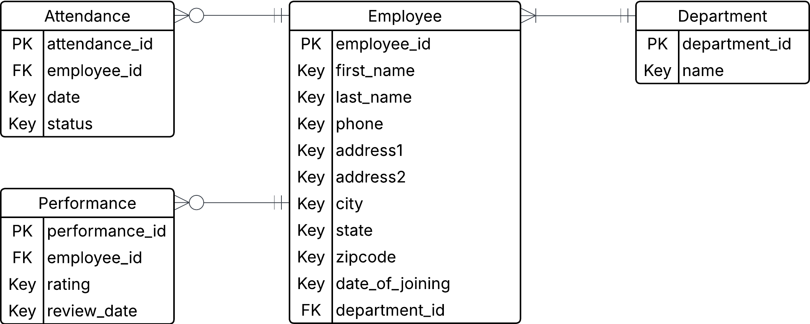

# Employee Management System API


A Django REST Framework API for managing employees, departments, attendance, and performance evaluations.

### Key Features

- Employee and Department management
- Attendance tracking (Present/Absent/Late)
- Performance evaluations (1-5 rating)
- Pagination and filtering enabled for long results
- JWT authentication
- Swagger API documentation
- Docker support with PostgreSQL


## Table of Contents
1. [Quick Start](#quick-start)
1. [Project Architecture](#project-architecture)
1. [API Endpoints](#api-endpoints)
1. [User Roles](#user-roles)
1. [Authentication](#authentication)
1. [Management Commands](#management-commands)


## Quick Start

### Prerequisites
- [Python 3.11+](https://www.python.org/downloads/)
- [Docker and Docker Compose](https://docs.docker.com/engine/install/)

### Setup
1. Clone and navigate to project
   ```bash
   git clone https://github.com/szshn/employee-management-system.git
   cd employee-management-system
   ```

2. Create environment file
   ```bash
   cp .env.example .env
   # Edit .env with your database credentials
   ```

3. Start with Docker or virtual environment

   ```bash
   # Docker
   docker-compose up --build

   # Virtual environment
   python -m venv venv
   source venv/bin/activate   # macOS/Linux
   venv/Scripts/Activate      # Windows
   python manage.py migrate
   python manage.py setup_db
   python manage.py runserver
   ```

4. Access the application
   - API Root: http://localhost:8000/
   - Admin Panel: http://localhost:8000/admin/
   - API Documentation
      - http://localhost:8000/docs/redoc/
      - http://localhost:8000/docs/swagger/

Read [Management Commands](#management-commands) section to learn about available Django commands to set up database and seed sample data. 


## Project Architecture
The project is a Django REST Framework (DRF) API that follows a layered architecture pattern optimized for API development. The system uses a Model-Serializer-View-URL pattern.

The project implements a RESTful API architecture with the following layers:

```
┌─────────────────────────────────────────────────────────┐
│                ~ Authentication Layer ~                 │
│   JWT-based authentication with role-based permissions  │
├─────────────────────────────────────────────────────────┤
│                      ~ API Layer ~                      │
│  DRF serializers for data transformation and views for  |
|           request handling Response Handling            │
├─────────────────────────────────────────────────────────┤
│                    ~ Service Layer ~                    │
│    Django models with custom methods and validation     │
├─────────────────────────────────────────────────────────┤
│                     ~ Data Layer ~                      │
│       PostgreSQL database with Django ORM models        │
└─────────────────────────────────────────────────────────┘
```

### Technology Stack

- **Backend Framework**: Django 5.2.3 + Django REST Framework
- **Database**: PostgreSQL 14
- **Authentication**: JWT via Django REST Framework Simple JWT
- **API Documentation**: drf-spectacular (OpenAPI 3.0/Swagger)
- **Filtering & Pagination**: Django Filter with built-in DRF pagination
- **Deployment**: Docker + Docker Compose
- **Data Generation**: Faker library for realistic test data

### Application Structure
The project consists of two main Django apps:
- **employees** handles organizational data (employees and departments).
- **evaluations** manages performance data (attendance and performance reviews).

Each app follows the DRF architectural pattern:
- Request → URL Router → View → Serializer → Model → Database
- Response ← JSON ← Serializer ← View ← Model ← Database

### Directory Structure
```
employee-management-system/
├── employee_project/   # Main project settings
│   ├── settings.py
│   ├── urls.py
│   └── wsgi.py
├── employees/          # Employee & Department management app
│   ├── models.py
│   ├── serializers.py
│   ├── views.py
│   ├── urls.py
│   └── management/commands/
├── evaluations/        # Attendance & Performance management app
│   ├── models.py
│   ├── serializers.py
│   ├── views.py
│   ├── urls.py
│   └── management/commands/
├── manage.py
├── requirements.txt
├── Dockerfile
├── docker-compose.yml
├── .env.example
└── README.md
```

### Data Models & Relationship



## User Roles
The endpoint request access differs by the user roles. Built on top of Django's User model, there are 4 different types of users and permissions.

| User type | Description | Permission (Organization) | Permission (Evaluation) |
| --------- | ----------- | ------------------------- | ----------------------- |
| **Superuser** | Superuser or admin of the PostgreSQL database | All | All |
| **HR Member** | Member of the HR department | All | All |
| **Staff** | Staff/Manger of the department | All read actions & update for their department members only | All read & create/update for their department members only |
| **Employee** | Non-staff level employee | All read actions | Read their own records only |

While deleting employee or department records is possible, it is recommended to PATCH to deactivate the status in order to preserve legacy data.


## API Endpoints
Employee Management System API supports CRUD operations across employee, department, attendance, and work performance evaluation records. 

A simple, user-friendly API documentation with more details—including request and response formats and status codes—is available at http://localhost:8000/docs/redoc/. An interactive API documentation is available at http://localhost:8000/docs/swagger/. 

### Overview

#### Employee managment
|           Endpoint          | Description | Permission (with authentication) |
|-----------------------------|-------------| ------------------------------- |
| `GET    /employees/`        | Retrieve the list of all employees | Everyone |
| `POST   /employees/`        | Create a new employee staff | Superuser/HR/Staff |
| `GET    /employees/{id}`    | View an employee with the corresponding ID | Everyone |
| `PUT    /employees/{id}`    | Update all fields of the employee with the corresponding ID | Superuser/HR/Staff |
| `PATCH  /employees/{id}`    | Update some fields of the employee with the corresponding ID | Superuser/HR/Staff |
| `DELETE /employees/{id}`    | Delete the employee with the corresponding ID | Superuser/HR |

#### Department management
|           Endpoint          | Description | Permission (with authentication) |
|-----------------------------|-------------| ------------------------------- |
| `GET    /departments/`      | Retrieve the list of all departments | Everyone |
| `POST   /departments/`      | Create a new department | Superuser/HR |
| `GET    /departments/{id}`  | View a department with the corresponding ID | Everyone |
| `PUT    /departments/{id}`  | Update all fields of the department with the corresponding ID | Superuser/HR |
| `PATCH  /departments/{id}`  | Update some fields of the department with the corresponding ID | Superuser/HR |
| `DELETE /departments/{id}`  | Delete the department with the corresponding ID | Superuser/HR |

#### Attendance
|           Endpoint          | Description | Permission (with authentication) |
|-----------------------------|-------------| ------------------------------- |
| `GET    /attendances/`      | Retrieve the list of all attendances | Everyone |
| `POST   /attendances/`      | Create a new attendance record | Superuser/HR/Staff |
| `GET    /attendances/{id}`  | View an attendance record with the corresponding ID | Everyone |
| `PUT    /attendances/{id}`  | Update all fields of the attendance with the corresponding ID | Superuser/HR/Staff |
| `PATCH  /attendances/{id}`  | Update some fields of the attendance with the corresponding ID | Superuser/HR/Staff |
| `DELETE /attendances/{id}`  | Delete the attendance with the corresponding ID | Superuser/HR |

#### Performance
|           Endpoint          | Description | Permission (with authentication) |
|-----------------------------|-------------| ------------------------------- |
| `GET    /performances/`     | Retrieve the list of all performance records | Everyone |
| `POST   /performances/`     | Create a new performance record | Superuser/HR/Staff |
| `GET    /performances/{id}` | View a performance record with the corresponding ID | Everyone |
| `PUT    /performances/{id}` | Update all fields of the performance record with the corresponding ID | Superuser/HR/Staff |
| `PATCH  /performances/{id}` | Update some fields of the performance record with the corresponding ID | Superuser/HR/Staff |
| `DELETE /performances/{id}` | Delete the performance record with the corresponding ID | Superuser/HR |

#### Others
|           Endpoint          | Description | Permission |
|-----------------------------|-------------| ------------------------------- |
| `GET    /`                  | View available endpoint URLs | Everyone |
| `POST   /login`             | Get a JWT token for API access | Everyone |
| `POST   /login/refresh`     | Refresh the JWT token | Everyone |
| `GET    /docs/swagger`      | Interactive API documentation with Swagger UI | Everyone |
| `GET    /docs/redoc`        | User-friendly API documentation with RedDoc | Everyone |
| `GET    /docs/schema`       | Download yaml schema file | Everyone |


## Authentication
All API endpoints requires [JWT authentitcation](https://www.jwt.io/introduction), a stateless token-based authentication scheme, to protect data from external users. You must have a valid credential for the employee system or superuser credential to authenticate. Once generated, the token is valid for 1 hour and can be refreshed for 30 days.

To create a JWT token, send a POST request to `/api/login`.
```bash
curl -X POST \
   http://localhost:8000/api/login \
   -d '{
      "username": "admin", 
      "password": "password"
   }'

# Response body
{
  "refresh": "encoded-jwt-refresh-token",
  "access": "encoded-jwt-access-token"
}
```

To renew the JWT token, send a POST request to `api/login/refresh`.
```bash
curl -X POST \
   http://localhost:8000/api/login/refresh \
   -d '{"refresh": "encoded-jwt-refresh-token"}'

# Response body
{
   "access": "new-encoded-jwt-access-token"
}
```

When making API access, make sure to include the token in the header.
```bash
curl -X GET \
   http://localhost:8000/employees/ \
   -H 'Authorization: Bearer {your-jwt-access-token}' 
```


## Management Commands
The program provides several custom Django management commands to streamline your exploration. All arguments are optional.

### Set up database
Having a superuser can be beneficial as it can be used to view data in the admin panel. If the database doesn't have a superuser yet, the `setup_db` command helps create a superuser with
- username: admin
- email: admin@example.com
- password: password

It is highly recommended to change the password after login. Alternatively, users can manually create a PostgreSQL superuser.

```bash
python manage.py setup_db
```

### Seed initial data
These command are for **complete initialization**; they will prompt to ask if it is okay to clear all related records. Organization seed data use Faker library to mimic realistic data field, and evaluation seed data use random numbers.

```bash
python manage.py init_data       # for employees and departments
```
#### Arguments
- `--count`: number of employees to create (default: 40)
- `--seed`: seed for reproducible fake data (default: 0)
- `--force`: skip the confirmation prompt

<br>

```bash
python manage.py init_reports    # for attendance and performance reviews
```
#### Arguments
- `--attendance`: number of attendance records to create (default: 20)
- `--reviews`: number of performance reviews to create (default: 10)
- `--force`: skip the confirmation prompt

### Seed additional data
Use these commands after `init_data` and/or `init_reports` to add more sample data. Running them before will cause exiting with error. They will prompt warning if the input seed value will lead to duplciate data and ask for another.

```bash
python manage.py seed_employees  # for employees and departments
```
#### Arguments
- `--count`: number of employees to create (default: 40)
- `--seed`: seed for reproducible fake data (default: 0)
- `--force`: skip the confirmation prompt

```bash
python manage.py seed_reports    # for attendance and performance reviews
```
#### Arguments
- `--attendance`: number of attendance records to create (default: 20)
- `--reviews`: number of performance reviews to create (default: 10)
- `--force`: skip the confirmation prompt

### Reset
Use this command to clear all data including employees, departments, attendance, and performance.

```bash
python manage.py reset_all
```
#### Arguments
- `--force`: skip the confirmation prompt